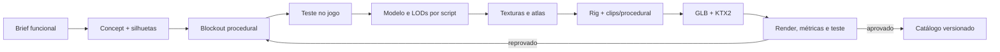

# Open Dungeon VR — produção FULL IA

- **Versão:** 1.0
- **Data:** 24 de agosto de 2026
- **Decisão:** o usuário não realizará modelagem, UV, rigging, animação ou pintura manual

## 1. Objetivo

Construir todo o conteúdo visual e interativo do jogo por geração de imagens, geometria procedural, scripts de criação 3D, animação procedural e automação de QA. O usuário atua como diretor: aprova alternativas e resultados jogáveis.

FULL IA não significa aceitar automaticamente o primeiro resultado. Significa que a iteração, correção e regeneração também são executadas pela IA.

## 2. Princípios

1. **Jogável antes de detalhado:** todo asset nasce dentro de uma interação funcional.
2. **Silhueta antes de textura:** o modelo deve ser reconhecível sem material.
3. **Famílias antes de indivíduos:** esqueletos, materiais e módulos são reutilizados.
4. **Procedural quando previsível:** armas, itens, salas e criaturas segmentadas favorecem geometria por código.
5. **Imagem como referência, não malha:** concept art não é tratado como modelo 3D pronto.
6. **Automação com inspeção:** renders, métricas e testes acompanham toda exportação.
7. **Quest é o limite:** qualidade é medida dentro do orçamento WebXR, não pelo render offline.
8. **Proveniência registrada:** nenhuma imagem, textura ou modelo externo entra sem origem e licença.

## 3. Direção visual compatível

### Linguagem escolhida

- fantasia sombria estilizada;
- volumes facetados e grandes;
- proporções exageradas;
- detalhes concentrados em rosto, mãos e arma;
- materiais pintados com resposta PBR simples;
- desgaste e runas em máscaras reutilizáveis;
- contraste alto entre ameaça, cenário e interação.

### Famílias prioritárias

- esqueletos e armaduras modulares;
- golens de pedra, metal ou cristal;
- cavaleiros vazios;
- autômatos;
- fungos e criaturas vegetais;
- espíritos com máscaras e tecidos rígidos;
- slimes e formas sem anatomia complexa;
- criaturas segmentadas.

### Fora do escopo inicial

- humanos fotorrealistas;
- cabelo individual simulado;
- tecido complexo em tempo real;
- anatomia muscular realista;
- rostos com atuação facial cinematográfica;
- criaturas cujo apelo dependa de skinning orgânico de nível AAA.

## 4. Pipeline por asset



### Arte conceitual

Para cada asset relevante serão gerados:

- folha de silhuetas;
- vista de apresentação;
- vistas frontal, lateral e traseira quando necessárias;
- paleta e materiais;
- escala ao lado do jogador;
- detalhes de interação;
- lista explícita do que deve permanecer invariável nas iterações.

### Geometria

Ordem de preferência:

1. Three.js procedural para blockouts, armas, itens, bolsas e cenário modular.
2. Scripts Blender headless para malhas orgânicas estilizadas, UV, rig, animações, LOD e GLB.
3. Assets CC0 apenas como placeholder ou matéria-prima documentada.

O Blender poderá ser instalado quando o primeiro asset ultrapassar o que a geometria procedural do runtime entrega. Depois da instalação, sua operação continuará automatizada e não exigirá ação manual do usuário.

### Texturas

Conjunto padrão:

- `baseColor`;
- `normal`, somente quando acrescentar forma perceptível;
- `ORM`, agrupando oclusão, roughness e metallic;
- `emissive`, somente para magia e leitura funcional.

Processamento automático:

1. gerar ou obter fonte licenciada;
2. remover luz e sombra incorporadas quando inadequadas;
3. corrigir repetição e costuras;
4. reduzir ruído de alta frequência;
5. adequar à paleta da facção;
6. montar atlas;
7. criar mipmaps;
8. comprimir em KTX2;
9. comparar visual e memória antes/depois.

### Rig e animação

Esqueletos canônicos:

```text
humanoid_standard
humanoid_large
quadruped
crawler
flying
golem
serpent
```

Cada rig declara:

- ossos deformadores;
- limites anatômicos;
- sockets de arma e VFX;
- hitboxes;
- pontos de IK;
- root motion permitido ou proibido;
- perfil de LOD de animação.

Animação combina clips gerados por keyframes com camadas procedurais:

- olhar e mira;
- IK de pés e mãos;
- inclinação por velocidade;
- variação controlada de timing;
- reação direcional ao impacto;
- posicionamento de arma;
- stagger e recuperação.

Todo ataque mantém estados explícitos: `preparação → ativo → impacto único → recuperação`.

## 5. Armas e itens

Todo asset segurável possui:

```text
asset_root
grip_primary
grip_secondary
damage_origin
damage_tip
throw_origin
holster_left
holster_right
back_socket
vfx_socket
```

Metadados obrigatórios:

- escala real em metros;
- massa percebida e física;
- mão permitida;
- collider simplificado;
- gesto principal;
- categoria de armazenamento;
- orientação de snap;
- ícone e nome;
- família visual e versão.

## 6. Bolsa da aventura

A bolsa é física na apresentação e assistida na regra. Objetos não ficam simulando livremente dentro dela.

### Interação

1. Jogador alcança a bolsa no quadril, peito ou posição configurada.
2. Abrir revela sockets ampliados.
3. Aproximar item compatível destaca o destino.
4. Soltar aplica snap e feedback háptico.
5. O item vira uma representação compacta persistente.
6. Puxar a representação materializa o objeto na mão.
7. Item perdido retorna ao último slot depois de intervalo seguro.

### Requisitos

- quatro slots rápidos;
- duas presilhas externas;
- compartimento separado para missão;
- recursos agregados automaticamente;
- modo canhoto espelhado;
- posição, altura e escala ajustáveis;
- alternativa por botão;
- suporte sentado e a um braço;
- nenhuma perda por colisão ou queda fora do mundo.

## 7. Budgets iniciais

| Asset | Triângulos | Textura | Rig |
| --- | ---: | --- | ---: |
| Inimigo comum | 12k–25k | 1× 1024² | 30–60 ossos deformadores |
| Elite | 20k–35k | 1–2× 1024² | 40–70 |
| Boss | 35k–60k | até 2× 2048² | definido por profiling |
| Arma | 1k–6k | 512² | sem rig ou rig mínimo |
| Item de bolsa | 300–2k | 256²–512² | sem rig |
| Prop de cenário | 200–5k | atlas compartilhado | sem rig |

Regras:

- máximo de quatro influências de osso por vértice;
- LOD obrigatório para inimigo e boss;
- collider não replica a malha visual;
- materiais são compartilhados por família;
- transparência é exceção;
- budgets mudam somente após medição no Quest.

## 8. QA automático de asset

Toda exportação deve produzir ou verificar:

- nome e versão;
- render frontal, lateral, traseiro e perspectiva;
- turntable quando possível;
- triângulos, vértices, materiais e draw calls previstos;
- dimensões e orientação;
- UV fora do intervalo ou sobreposição não intencional;
- texturas e canais esperados;
- ossos, pesos e máximo de influências;
- clips, duração e loop;
- sockets obrigatórios;
- collider e bounds;
- carregamento do GLB no Three.js;
- descarte sem vazamento;
- aparência no jogo em iluminação clara e escura.

Um asset só é final quando funciona no runtime. Render bonito isolado não é gate de aprovação.

## 9. Catálogo e rastreabilidade

Cada asset terá um manifesto semelhante a:

```json
{
  "id": "enemy_bone_guardian_v1",
  "source": "ai-generated",
  "conceptPrompt": "assets/prompts/enemy_bone_guardian_v1.md",
  "generator": "procedural-blender",
  "license": "project-original",
  "model": "assets/models/enemies/bone-guardian-v1.glb",
  "textures": ["bone-guardian-v1-base.ktx2", "bone-guardian-v1-orm.ktx2"],
  "rig": "humanoid_large_v1",
  "lods": 2,
  "approved": false
}
```

Prompts, seeds quando disponíveis, imagens escolhidas, scripts e parâmetros de exportação permanecem versionados. Isso permite regenerar, comparar e corrigir sem depender de memória da conversa.

## 10. Critério de sucesso da pipeline

A pipeline FULL IA estará validada quando o Guardião Ossário puder ser regenerado a partir dos arquivos do projeto e apresentar, sem edição manual:

- identidade visual coerente;
- modelo final e LOD;
- materiais comprimidos;
- rig funcional;
- idle, locomoção, dois ataques, defesa, stagger e morte;
- arma e sockets alinhados;
- collider e hitboxes;
- combate completo em desktop e VR;
- build reproduzível e relatório de QA.

