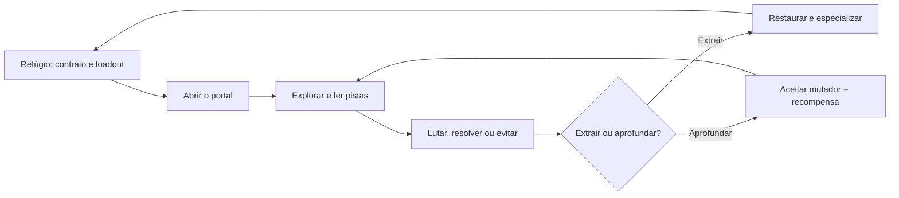

# Open Dungeon VR — Game Design Document

- **Versão:** 0.2
- **Data:** 24 de agosto de 2026
- **Estado:** conceito / pré-produção
- **Plataforma principal:** Meta Quest 3 via WebXR
- **Plataformas secundárias:** navegador desktop e PC VR/OpenXR, após validação
- **Jogadores:** 1–4
- **Modelo:** premium; expansões de conteúdo e cosméticos sem atributos
- **Nome:** provisório
- **Produção:** FULL IA; nenhuma modelagem manual exigida do usuário

## 1. High concept

**Open Dungeon VR** é um action RPG cooperativo em primeira pessoa no qual aventureiros descem a uma masmorra viva, resgatam fragmentos de lugares consumidos e decidem quais partes do mundo restaurar em seu refúgio. Cada expedição dura de 20 a 30 minutos, combina salas autorais por regras procedurais e termina com uma escolha: extrair o que foi encontrado ou aprofundar a run, elevando risco, recompensa e transformação do mapa.

O jogo entrega a fantasia tátil de abrir portas, aparar golpes, recarregar armas, lançar magia e cooperar fisicamente. A novidade não é prometer “salas infinitas”, mas fazer cada expedição produzir uma história compreensível: um objetivo, uma facção dominante, uma mudança no espaço, uma decisão de grupo e uma consequência visível no refúgio.

### Pitch em uma frase

> Um dungeon crawler VR cooperativo em que a masmorra lembra suas decisões e o refúgio que você reconstrói muda as próximas expedições.

### Não é

- uma cópia de *Dungeons of Eternity* ou *Pixel Dungeon VR*;
- um MMO, live service ou sandbox infinito no lançamento;
- um jogo que confunde aleatoriedade com variedade;
- uma simulação de espada baseada em força física real;
- uma experiência que exige grupo para ser concluída;
- uma vitrine de WebXR sem campanha, progressão e final.

## 2. Problema de produto e oportunidade

Os melhores dungeon crawlers VR provam que combate físico, loot e co-op formam um loop prazeroso. O desgaste surge quando o jogador reconhece as mesmas salas e ondas, quando toda progressão converge, quando distância elimina risco e quando dificuldade apenas infla números.

Open Dungeon VR ocupa este espaço:

1. **Runs com intenção:** objetivo e pressão mudam a forma de atravessar a dungeon.
2. **Combate com leitura:** direção, timing, espaço e função de grupo importam mais que agitar o controle.
3. **Procedural com memória:** regras combinam conteúdo autoral e registram consequências.
4. **Co-op sem dependência:** escala de um a quatro, com companheiro espectral opcional no solo.
5. **VR confortável por padrão:** verticalidade possui aviso e alternativas; toda a jornada existe dentro do headset.
6. **Jogo completo:** campanha com desfecho, seguida por contratos e mutadores, sem depender de promessa futura.

## 3. Pilares

### 3.1 Toda porta é uma decisão

O mapa físico informa risco, rumor e rota, não o conteúdo exato. O grupo escolhe entre segurança, recurso, resgate, atalho e ameaça. Uma porta não deve significar automaticamente “próxima arena”.

### 3.2 Mãos fazem coisas memoráveis

Interações físicas são curtas, confiáveis e expressivas: encaixar uma runa, segurar a lanterna para um aliado, aparar, puxar uma flecha, lançar um machado, estabilizar uma ponte. Nenhuma ação frequente exige precisão milimétrica.

### 3.3 A dungeon reage

Barulho, tempo, facção e escolhas alimentam um Diretor de Tensão. Inimigos patrulham, investigam e recuam; hazards podem ser usados contra eles. A dungeon não espera passivamente atrás de cada porta.

### 3.4 Cooperação cria opções

O grupo abre caminhos e combina ferramentas, mas não depende de classes rígidas. Toda função essencial possui solução solo, mais lenta ou arriscada. Reviver é tenso, limitado e legível.

### 3.5 Progresso amplia possibilidades

Novos itens, gestos, contratos e rotas aumentam escolhas horizontais. Números crescem de modo limitado; equipamento inicial nunca se torna lixo automático.

## 4. Público, sessão e promessa

### Público principal

- jogadores de Quest que procuram aventura cooperativa recorrente;
- fãs de action RPG, roguelite e exploração de dungeon;
- grupos de dois a quatro amigos;
- jogadores solo que querem campanha completa, não um modo reduzido.

### Cadência

| Momento | Duração alvo | Resultado |
| --- | ---: | --- |
| Preparação no refúgio | 2–4 min | Contrato, loadout e conforto confirmados |
| Setor de dungeon | 5–8 min | Descoberta, combate ou problema espacial |
| Expedição padrão | 20–30 min | 3 setores + guardião ou extração |
| Deep run opcional | 35–50 min | 5 setores, mutadores acumulados e loot raro |
| Campanha principal | 8–12 h | 6 capítulos e desfecho |

### Promessa dos primeiros 10 minutos

O jogador aprende a pegar, guardar, golpear, bloquear, mover-se e abrir o mapa; enfrenta um inimigo simples; encontra uma escolha de rota; resgata o primeiro fragmento; retorna e vê uma parte do refúgio reconstruída. Nenhum menu de talentos complexo aparece antes dessa fantasia estar comprovada.

## 5. Core loop



### Loop de 30 segundos

1. Ler inimigo, ambiente e espaço disponível.
2. Escolher arma, postura ou ferramenta.
3. Executar ação física com feedback visual, sonoro e háptico.
4. Receber nova informação: abertura, stagger, ameaça ou recurso.
5. Reposicionar e coordenar.

### Loop de cinco minutos

1. Escolher rota.
2. Descobrir a situação da sala.
3. Resolver por combate, habilidade, hazard ou custo.
4. Consumir ou preservar recursos.
5. Alterar o estado da expedição.

## 6. Estrutura de campanha

A Cidadela Aberta foi quebrada em fragmentos e engolida pela masmorra. Cada capítulo recupera um distrito e revela por que a dungeon aprendeu a copiar lugares, pessoas e conflitos.

| Capítulo | Bioma | Facção | Mecânica nova | Mudança no refúgio |
| --- | --- | --- | --- | --- |
| 1 — Portão Partido | Cripta de pedra e raízes | Ossários | Chaves, bloqueio, mapa físico | Ferreiro e portal |
| 2 — Arquivo Afogado | Biblioteca inundada | Escribas vazios | Água, luz e sigilos | Arquivo de rumores |
| 3 — Forja Suspensa | Fundição sobre abismos | Autômatos | Calor, pontes e máquinas | Oficina de módulos |
| 4 — Jardim Invertido | Ruínas vegetais verticais | Enxame micelial | Esporos, cordas e antídotos | Estufa e consumíveis |
| 5 — Cidade Sem Lua | Distrito urbano enterrado | Corte do Eco | Furtividade, alarme e civis | Mercado e contratos |
| 6 — Coração Aberto | Dungeon mutável | Todas | Recombinação e escolhas finais | Epílogo variável |

Cada capítulo contém duas missões autorais de história, contratos procedurais e um guardião. Missões autorais fixam momentos dramáticos; salas intermediárias ainda variam. Assim, a narrativa não depende de uma combinação aleatória funcionar.

## 7. Expedições e objetivos

### Tipos de contrato

| Contrato | Verbo principal | Pressão | Falha interessante |
| --- | --- | --- | --- |
| Resgate | Localizar e escoltar um eco | Alarme crescente | O eco vira pista para outra run, não desaparece |
| Relicário | Encontrar, carregar e extrair | Uma mão ocupada / portador visado | Relíquia quebra em fragmentos menores |
| Caçada | Rastrear alvo móvel | Alvo foge e muda salas | Facção fortalece futuro setor |
| Selamento | Ativar três âncoras | Ordem altera hazards | Uma rota do mapa é corrompida |
| Pilhagem | Atingir valor e sair | Ganância aumenta ameaça | Grupo preserva parte do saque |
| Cartografia | Revelar e marcar anomalias | Poucos recursos, mapa amplo | Conhecimento parcial persiste |

### Regra de composição

Uma expedição é gerada a partir de:

`seed + capítulo + contrato + facção + mutador + histórico do refúgio`

O gerador escolhe topologia antes de decorar. Deve garantir:

- caminho crítico, rota opcional e ao menos um retorno/atalho;
- alternância de intensidade;
- no máximo duas salas de combate direto consecutivas;
- uma descoberta não combativa por setor;
- solução acessível ao solo para toda trava obrigatória;
- validação automática de conectividade, escala, clearance e orçamento de renderização.

### Situações, não salas isoladas

Uma sala autoral declara entradas, saídas, cobertura, altura, sockets de hazard, luz, patrulha e possíveis objetivos. O Diretor combina esses elementos sob um orçamento. A mesma forja pode ser território neutro, emboscada, puzzle térmico, travessia silenciosa ou arena de guardião — sem fingir que trocar inimigos criou um espaço novo.

## 8. Diretor de Tensão

O Diretor acompanha valores legíveis e testáveis:

- ruído recente;
- dano sofrido e recursos do grupo;
- tempo desde o último pico;
- número de jogadores ativos;
- alarmes e reputação com a facção;
- profundidade e mutadores;
- repetição recente de inimigos e situações.

Ele pode antecipar patrulha, fechar uma rota, oferecer sala de recuperação, mudar posição de reforço ou ativar hazard. Não pode:

- criar inimigo no campo de visão;
- causar dano sem telegraph;
- aumentar HP secretamente para prolongar luta;
- punir um grupo porque está jogando bem;
- quebrar a seed ou tornar replay impossível de diagnosticar.

## 9. Combate VR

### Princípios

1. Golpe válido exige deslocamento mínimo e arco coerente, com teto de velocidade para impedir vantagem por tremor.
2. Dano considera tipo, timing, direção e região, não força física bruta.
3. Toda ação inimiga perigosa possui preparação visual e sonora.
4. Parry abre oportunidade; bloqueio absorve com custo; esquiva reposiciona.
5. Ranged troca segurança por munição, recarga, linha de visão e pressão inimiga.
6. Haptics confirmam contato, mas som e animação carregam a informação principal.

### Estados de golpe melee

`preparação → janela ativa → impacto único → recuperação`

- O mesmo swing só acerta cada alvo uma vez.
- Movimento minúsculo não causa dano completo.
- Velocidade acima do teto não multiplica dano.
- Golpe deliberado recebe bônus moderado de postura/ângulo, nunca exige força.
- Armas atravessam o cenário visualmente apenas quando necessário para evitar prender a mão; o resultado de gameplay comunica bloqueio e desvio.

### Arsenal inicial

| Família | Fantasia física | Força | Limite |
| --- | --- | --- | --- |
| Espada curta | corte e parry | versátil | alcance curto |
| Machado de retorno | golpe/arremesso/chamada | burst e alvo aéreo | recuperação expõe o jogador |
| Maça | quebrar armadura | stagger | recuperação longa |
| Lança | duas mãos ou arremesso | controle de corredor | fraca em espaço apertado |
| Arco | puxar e soltar | precisão e pontos fracos | pressão durante preparo |
| Besta | puxar corda e inserir virote | dano seguro | recarga manual lenta |
| Foco rúnico | desenhar direção + gatilho | controle elemental | cargas limitadas |
| Escudo-ferramenta | bloquear e empurrar | proteção do grupo | ocupa mão e stamina |

### Equilíbrio melee × ranged

- Inimigos com escudo, salto, teleporte curto, cobertura e projéteis de supressão contestam distância.
- Melee gera mais stagger, interrompe habilidades e recupera recurso de classe.
- Munição especial é limitada; ataque básico de arco continua disponível, mas menos explosivo.
- Arenas sempre oferecem espaço de aproximação e fuga; nenhuma arma domina por geometria universal.
- Telemetria compara dano, dano sofrido, tempo de exposição e taxa de escolha por arma.

## 10. Inimigos e dificuldade

### Papéis de combate

- **Pressor:** fecha distância e desloca o jogador.
- **Guardião:** protege aliado, objetivo ou corredor.
- **Atirador:** força quebra de linha de visão.
- **Controlador:** cria área perigosa ou altera espaço.
- **Caçador:** reage a jogador isolado ou ranged estático.
- **Suporte:** fortalece, cura ou convoca e vira prioridade.

Uma composição usa dois ou três papéis complementares. Quantidade escala com o grupo, mas o jogo evita simplesmente quadruplicar inimigos.

### Escala de dificuldade

| Nível | Mudança principal | Ajuste numérico permitido |
| --- | --- | --- |
| História | telegraphs longos, economia generosa, companheiro forte | dano inimigo reduzido |
| Aventureiro | kit completo e composições padrão | baseline |
| Veterano | novos padrões, flancos, hazards conectados | +10% vida no máximo |
| Abismo | menos informação, objetivos simultâneos, elites com contrajogo | +20% dano no máximo |

HP nunca é o principal eixo. Dificuldade altera comportamento, composição, economia, tempo e espaço. Toda habilidade nova entra no bestiário após ser vista.

### Bosses

Cada guardião possui três verbos aprendíveis e duas fases que recombinam esses verbos. Fases não são apenas mais vida. O grupo pode descobrir uma vantagem ambiental durante o capítulo; quem não a encontra ainda pode vencer por habilidade.

## 11. Coop, solo e social

### Formação de grupo

- solo, privado por código, amigos, público e convite durante o refúgio;
- cross-play quando PC VR existir;
- entrada tardia apenas entre setores, nunca no meio de boss ou evento narrativo;
- convidado pode jogar o primeiro capítulo completo com um dono, sujeito à viabilidade comercial da plataforma;
- voz espacial com ducking automático de música.

### Ferramentas obrigatórias

- mute por voz e por jogador;
- volume individual;
- kick por anfitrião ou voto configurável;
- bloqueio impede reentrada na mesma sala;
- tags de idioma, estilo e faixa etária permitida pela plataforma;
- comunicação rápida por ping, gesto e roda de intenção;
- espaço pessoal reduz opacidade de avatar muito próximo.

### Regras de loot

- cada jogador recebe loot próprio compatível com seu histórico;
- itens podem ser mostrados e trocados no refúgio, nunca vendidos por dinheiro real;
- item raro possui proteção contra azar: fragmentos acumulados permitem fabricar a família desejada;
- cosmético é independente de atributo;
- ninguém precisa correr para pegar moeda antes dos aliados.

### Solo

O jogador pode invocar um Eco com três posturas simples: acompanhar, segurar posição e focar alvo. O Eco não resolve puzzles sozinho por mágica; ele ocupa alavancas, carrega objeto ou cobre uma rota quando comandado. Bosses e contagens adaptam comportamento, não só HP.

## 12. Progressão

### Durante a run

O jogador escolhe uma de três runas após cada setor. Elas formam uma build temporária e excludente. Exemplo para machado:

- retorno atravessa um segundo alvo;
- captura perfeita restaura escudo;
- impacto no cenário cria onda curta.

Escolhas devem alterar gesto, alvo ou timing, não apenas `+5% dano`.

### Entre runs

- **Conhecimento:** bestiário, rumores, rotas e receitas.
- **Maestria:** desbloqueia alternativas laterais por família de arma.
- **Refúgio:** abre serviços, contratos e cenas da campanha.
- **Equipamento:** sidegrades com duas propriedades claras, sem raridades infinitas.
- **Cosméticos:** aparência sem stats.

### Limites anti-grind

- poder permanente possui teto baixo;
- respec é gratuito no refúgio;
- itens repetidos viram material direcionável;
- contratos indicam recompensa antes da entrada;
- nenhuma recompensa depende de login diário ou janela artificial;
- save é versionado e migra sem apagar inventário.

## 13. Inventário e interação

### No corpo

- coldre esquerdo e direito: armas de uma mão;
- costas: arma longa, arco ou escudo;
- pulso não dominante: vida, stamina, objetivo e estado do grupo;
- bolsa frontal: quatro consumíveis com snap generoso;
- mapa: objeto dobrável que pode ser segurado, preso ao pulso ou colocado no chão.

### No refúgio

O stash oferece visão espacial compacta e painel alternativo. Filtros obrigatórios:

- família;
- propriedade;
- nível de maestria;
- novo/favorito;
- loadout salvo;
- busca textual no desktop.

O jogador nunca precisa folhear cada blueprint individualmente.

## 14. Locomoção, conforto e acessibilidade

### Opções de movimento

- movimento suave por cabeça ou mão;
- teleporte;
- snap turn configurável em 15°, 30° ou 45°;
- smooth turn com velocidade ajustável;
- movimento físico e room-scale;
- modo sentado com calibração de altura;
- canhoto completo, inclusive coldres e UI;
- vignette separada para movimento, giro, queda e sprint.

### Verticalidade

- toda queda grande possui borda visual, áudio e zona de aviso;
- queda inesperada pode usar fade curto e aterrissagem estável;
- escada e corda aceitam gesto físico, analógico ou teleporte por trechos;
- plataformas móveis possuem opção de estabilidade de horizonte;
- caminhos críticos não exigem salto físico;
- configuração “verticalidade reduzida” troca abismos e elevadores por variantes seguras.

### Acessibilidade

- legendas com nome, direção e tamanho;
- alto contraste e símbolos que não dependem apenas de cor;
- remapeamento completo;
- segurar ou alternar grip;
- um braço: recarga assistida, troca automática de mão e gestos simplificados;
- redução de aracnídeos e sustos;
- intensidade de haptics, flashes, sangue e áudio separadas;
- pausa solo real; em co-op, jogador fica protegido apenas em sala segura.

## 15. UX no headset

Depois de **Entrar em VR**, o jogador completa onboarding, refúgio, matchmaking, expedição, resultado e nova partida sem encerrar a sessão.

### Regras

- ambos os controles apontam e selecionam;
- analógico oferece navegação equivalente;
- o centro da visão fica livre;
- HUD pertence ao pulso, corpo ou mundo, nunca colado à cabeça;
- painéis ficam a distância confortável e lembram altura preferida;
- hover, seleção e erro têm estados visuais e hápticos diferentes;
- ponteiros somem no gameplay e voltam apenas para UI;
- nenhuma confirmação destrutiva depende de gesto fácil de acionar por acidente.

### Onboarding adaptativo

O tutorial observa ações, não cronômetro. Jogador experiente pode demonstrar pegar, guardar, bloquear e mover-se para pular explicações. Opções de conforto são testadas numa sala neutra antes da primeira queda ou combate intenso.

## 16. Arte e áudio

### Direção visual

Fantasia estilizada de formas facetadas e texturas de baixa frequência, sem copiar o voxel literal de Pixel Dungeon. Cada facção tem:

- silhueta e proporção;
- material e resposta à luz;
- cor funcional;
- linguagem de movimento;
- assinatura sonora.

Dungeon escura mantém ambient light mínima, preenchimento do jogador, ritmo previsível de fontes e contraste entre piso, parede, ameaça e saída. Trocar paleta não conta como novo bioma.

### Áudio

- voz reduz música automaticamente;
- ataque inimigo possui assinatura direcional antes do impacto;
- contato de arma varia por material e resultado: raspão, bloqueio, parry e acerto;
- música responde ao Diretor, sem denunciar toda arena ao abrir uma porta;
- master, música, SFX, voz, ambiente e haptics têm controles independentes;
- áudio só começa após gesto permitido pelo navegador.

## 17. Economia e monetização

### Base

- compra premium;
- campanha, co-op e endgame básico incluídos;
- sem energia, login diário, passe de batalha ou anúncios no refúgio;
- sem arma, perk, token ou reroll vendido por dinheiro real.

### Expansões possíveis

- capítulos/biomas com campanha e inimigos novos;
- pacotes cosméticos que respeitem direção de arte;
- trilha sonora e supporter pack sem poder;
- todo jogador do grupo pode entrar em uma expansão se o anfitrião a possuir, mas recompensa exclusiva fica bloqueada até a compra — validar sustentabilidade antes de prometer.

## 18. Arquitetura recomendada

```text
open-dungeon-vr/
  app/                 casca, fluxo e UI
  core/
    combat/            regras de golpe, dano, postura e status
    dungeon/           seed, grafo, salas e validação
    director/          tensão, orçamento e eventos
    progression/       runas, maestria, loot e save
    contracts/         objetivos e falhas
  platform/
    input/             teclado, gamepad, WebXR
    network/           mensagens e reconciliação
    persistence/       save versionado
  view/
    three/             cena, rigs, VFX e áudio espacial
    hud/               pulso, mapa e painéis
  server/              salas, autoridade e persistência online
  tests/               regras headless e geração por seed
```

### Princípios técnicos

- um único loop de renderização;
- simulação de multiplayer em tick fixo; renderização interpolada;
- servidor autoritativo para dano, loot, portas, objetivos e seed;
- cliente prevê apenas movimento e apresentação segura;
- UI envia intenção; `core` decide resultado;
- RNG por sub-seeds: topologia, decoração, inimigos, loot e eventos separados;
- snapshots de UI limitados; sem state update React por frame;
- objetos temporários em pool; geometrias e materiais compartilhados;
- conteúdo novo entra por dados e contratos, não por condicionais na engine.

### Produção FULL IA

Conceitos, texturas, blockouts, modelos, rigs, animações, integração e validações serão criados ou orquestrados por IA. O usuário participa como diretor de produto: escolhe entre alternativas, aprova a direção e avalia a experiência, sem precisar modelar, pintar pesos, criar UVs ou animar manualmente.

A direção visual será compatível com a capacidade dessa pipeline: fantasia estilizada, formas facetadas, silhuetas fortes, materiais pintados e personagens construídos em famílias modulares. Realismo orgânico AAA não é requisito.

Regras completas, formatos, gates e limites estão em [AI-PRODUCTION.md](AI-PRODUCTION.md).

## 19. Performance e budgets

Meta inicial para Quest 3: **72 FPS estáveis**, buscando 80/90 apenas após profiling de uma expedição completa.

| Área | Budget de partida |
| --- | --- |
| Draw calls visíveis | até 120 em combate padrão |
| Inimigos ativos | 8 baseline; 12 somente após teste |
| Luzes dinâmicas com sombra | 1 principal; demais sem sombra/baked |
| Vozes de áudio 3D | até 24 priorizadas |
| Atualização do HUD | até 10 Hz para valores não críticos |
| Física interativa solta | até 30 objetos próximos, com sleep/pool |
| Memória de sala | descarregar mesh, collider, áudio e listeners juntos |

Budgets são hipóteses de pré-produção e devem ser substituídos por medidas no headset. Desktop não homologa performance VR.

## 20. Multiplayer e rede

### Autoridade

Servidor decide:

- seed e grafo da expedição;
- spawn e estado de inimigos;
- dano, revive, loot e objetivo;
- transição entre setores;
- kick, bloqueio e permissões da sala.

Cliente envia intenção compacta: pose amostrada, uso, ataque, alvo provável e comandos. Não transmite transform completo de todo objeto físico a cada frame.

### Tolerância

- agarrar e balançar arma devem parecer locais imediatamente;
- servidor valida alcance, cadência e arco de golpe;
- aliados usam interpolação e correção suave;
- reconexão preserva inventário da run por janela curta;
- host migration é desejável, mas não requisito do vertical slice se houver servidor dedicado;
- voice chat usa serviço próprio da plataforma ou solução auditada, separado da simulação.

## 21. Conteúdo mínimo

### Vertical slice

- refúgio pequeno;
- 1 contrato de relicário;
- 1 bioma, 10 salas autorais e 3 topologias;
- 4 inimigos cobrindo quatro papéis;
- 1 mini-boss;
- espada, machado, arco e escudo;
- solo e co-op para 2;
- movimento suave, teleporte, snap/smooth turn, sentado e canhoto;
- uma consequência persistente no refúgio;
- run de 15–20 minutos.

### MVP comercial

- campanha com 3 capítulos;
- 3 biomas, 36 salas autorais e 3 guardiões;
- 12 inimigos + variantes comportamentais;
- 8 famílias de arma;
- 6 contratos;
- co-op 1–4, público/privado/amigos;
- progressão, stash, filtros, troca e proteção contra azar;
- final de campanha e contratos pós-jogo.

### Visão 1.0

- 6 capítulos e 6 biomas;
- 72+ salas autorais combináveis;
- 18+ inimigos e 6 guardiões;
- deep runs, mutadores e favoritos de seed;
- PC VR/cross-play após estabilidade do Quest;
- ferramentas sociais e de acessibilidade completas.

## 22. Plano de produção

O desenvolvimento segue entregas pequenas e verticalmente completas. Cada entrega deve iniciar, permitir jogar seu loop, terminar ou reiniciar, gerar build e passar por validação. Um asset isolado ou um sistema acessível somente por código de debug não conta como entrega.

A ordem operacional e os critérios de entrada/saída estão em [DELIVERY-PLAN.md](DELIVERY-PLAN.md).

### Fase 0 — protótipos de risco

1. Laboratório de golpe, parry e anti-spam.
2. Sala WebXR com 72 FPS no Quest 3.
3. Geração de grafo determinístico validada headless.
4. Co-op de dois jogadores com agarrar, dano e revive.
5. Teste de conforto com queda, corda e escada alternativas.

### Fase 1 — vertical slice

Integrar uma run completa, do refúgio ao retorno. Nenhum sistema isolado conta como slice se a sessão XR precisa ser encerrada.

### Fase 2 — produção de conteúdo

Ferramentas de sala, sockets e validação vêm antes de multiplicar biomas. Cada nova sala passa por teste solo, 2P, 4P, conforto, conectividade e budget.

### Fase 3 — alpha e balanceamento

Testar retenção da fantasia, não retenção artificial: variedade percebida, escolha de armas, abandono por náusea, falha social e clareza de objetivo.

### Fase 4 — beta e 1.0

Conteúdo congelado, otimização de headset, migração de save, moderação, recuperação de rede e campanha completa.

## 23. Métricas e telemetria ética

Coletar somente com consentimento e sem gravação de voz ou ambiente físico:

- conclusão do onboarding e opção de conforto escolhida;
- FPS, frame spikes e crash por tipo de sala;
- duração, abandono e motivo de saída quando informado;
- dano/risco por família de arma;
- diversidade de situações vistas por run;
- rotas escolhidas e pontos de confusão;
- taxa de mute, kick, bloqueio e dissolução de grupo;
- falhas de revive, interação e inventário.

Não usar streak, notificações manipulativas ou tarefas diárias para fabricar engajamento.

## 24. QA e critérios de aceite

### Automatizados

- mesma seed e versão geram o mesmo grafo;
- toda dungeon possui entrada, objetivo, extração e caminho solo;
- não há socket incompatível, porta sem conexão ou sala inalcançável;
- no máximo duas arenas consecutivas;
- cada golpe causa no máximo um impacto por alvo;
- tremor rápido não supera swing deliberado;
- dano, loot e objetivo são autoritativos;
- pausa congela timers de gameplay solo;
- save migra entre versões suportadas;
- reinício limpa inimigos, itens, efeitos, listeners e timers.

### No Quest

- sessão completa sem sair de XR;
- calibração sentado/em pé e canhoto persistem;
- coldres são alcançáveis em diferentes corpos e cadeiras;
- texto e mapa são legíveis;
- teleporte, smooth locomotion, snap e smooth turn funcionam;
- queda reduzida e escalada assistida evitam movimento inesperado;
- nenhuma arma exige atingir parede real;
- 72 FPS no cenário de combate alvo, sem vazamento após cinco runs;
- voz continua compreensível com música e combate;
- jogador com um braço conclui onboarding e contrato com assistência.

### Multiplayer

- convite, código, público e reconexão;
- entrada tardia somente em ponto seguro;
- mute, kick e bloqueio persistente;
- aliado não pode duplicar loot por desconexão;
- alta latência não gera múltiplos impactos;
- queda de um cliente não destrói progresso dos demais;
- solo continua completo sem serviço de matchmaking.

## 25. Riscos e respostas

| Risco | Sinal precoce | Resposta |
| --- | --- | --- |
| Procedural parece repetitivo | jogadores nomeiam salas após 3 runs | variar objetivo/topologia/evento; cortar salas fracas; aumentar situações antes de decoração |
| Spam domina melee | frequência de swing prevê DPS | teto de velocidade, recuperação, stagger e telemetria por arco |
| Ranged elimina perigo | dano alto com exposição quase zero | caçadores, cobertura, recarga, pressão e vantagem de stagger melee |
| Quest não sustenta frame rate | spikes em salas densas | budgets, pooling, baked lighting, menos transparência e inimigos ativos |
| Co-op quebra campanha | diálogos ou decisões travam grupo | líder propõe, grupo vota, timeout seguro e recap individual |
| Solo parece secundário | objetivos exigem duas mãos/pessoas | Eco comandável e variantes solo testadas desde o slice |
| Progressão vira grind | escolha motivada só por tier | teto de poder, sidegrades, proteção contra azar e recompensa declarada |
| Náusea por verticalidade | abandono em quedas/cordas | aviso, vignette, fade, horizonte estável e rota reduzida |
| Engine monolítica | toda feature edita o loop central | módulos de domínio, contratos headless e dono único de estado |
| Escopo de conteúdo explode | biomas sem densidade de situações | lançar 3 capítulos sólidos antes de prometer 6 |

## 26. Decisões fechadas e questões abertas

### Fechadas para protótipo

- Quest 3/WebXR é o alvo de qualidade.
- Solo e co-op usam as mesmas regras centrais.
- Arte é estilizada, não voxel literal.
- Runs possuem extração opcional e campanha com final.
- Dificuldade muda comportamento antes de números.
- Progressão é horizontal e respec é gratuito.
- Melee possui anti-spam desde o primeiro protótipo.
- Toda a jornada funciona dentro da sessão XR.
- A produção é FULL IA; o usuário não precisa operar ferramentas de modelagem.
- Toda entrega é pequena, executável e funcional de ponta a ponta.
- Assets gerados entram no projeto somente com origem, licença e parâmetros registrados.

### A validar antes de produção

- WebXR standalone sustenta física, rede e fidelidade alvo ou exige build nativa?
- Servidor dedicado cabe no custo por sessão premium?
- “Amigo convidado” é permitido e financeiramente sustentável em todas as plataformas?
- Deep run deve permitir save entre setores?
- Troca de item favorece coop ou cria mercado externo indesejado?
- Qual grau de consequência narrativa pode coexistir com grupos diferentes sem fragmentar saves?

## 27. Referências e rastreabilidade

A síntese comparativa, limitações observadas e links das fontes estão em [BENCHMARK.md](BENCHMARK.md). As principais referências locais são:

- [Plano de entregas](DELIVERY-PLAN.md)
- [Produção FULL IA](AI-PRODUCTION.md)
- `../f-zone-vr/docs/GDD.md`
- `../f-zone-vr/docs/VR-UX.md`
- `../f-zone-vr/docs/TECHNICAL-DESIGN.md`
- `../f-zone-vr/docs/QA.md`
- `../aurora-wilds-VR/WILDS-ENGINEERING-HANDBOOK.md`

Este GDD usa essas referências como aprendizado técnico e crítico. Nomes, mundo, campanha, facções, estrutura de progressão e regras específicas de Open Dungeon VR são originais e provisórios.
